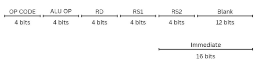
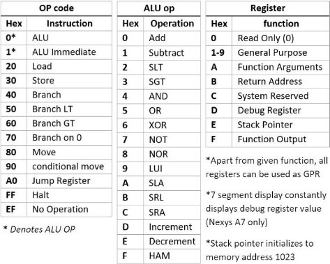
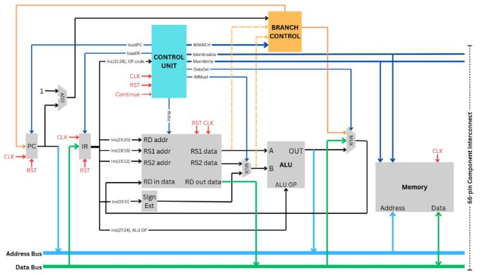

LO-RISC 

**Learning Optimized Reduced Instruction Set Computer** 

A minimal Instruction Set Architecture designed for speed and simplicity  

BY: Raaja Das (22CS30043) Priyanshu Gaurav (22CS10083) 

COA lab Final Project

Contents 

[Hardware ..................................................................................................................................................................... 3 ](#_page2_x33.00_y36.92)

[Instruction Set ............................................................................................................................................................... 3 ](#_page2_x33.00_y52.92)

[Data Path....................................................................................................................................................................... 4 ](#_page3_x33.00_y36.92)

[Input/Output ................................................................................................................................................................. 4 ](#_page3_x33.00_y496.92)[Software ....................................................................................................................................................................... 5 ](#_page4_x33.00_y36.92)

[Assembly ....................................................................................................................................................................... 5 ](#_page4_x33.00_y52.92)

[Dasmon ......................................................................................................................................................................... 6 ](#_page5_x33.00_y36.92)

 

Instruction Set

Each Instruction in LO-RISC is 32 bits long, divided into 8, 4-bit chunks representable by hexadecimal. 

**OP CODE** is connected to the control unit and essentially selects the instruction while **ALU OP** is directly connected to the ALU and selects its function. Three register operand addresses (4-bit each) follow, followed by 12 trailing blank (0) bits. For Immediate instructions **RS2** and Blank Bits are replaced by the **immediate** field.

**Examples:** 

add $1 $2 $3 ► 0x00123000 ► R1 = R2 + R3 

slai $5 $7 1 ► 0x1A570001 ► R5 = R7 << 1 

ld $3 8($6) ► 0x20360008 ► R3 = Mem[R6+8] 

br #10 ► 0x4000000A ► PC = PC + 10 

bmi $5 32 ►0x50050020 ► PC <= PC + 30 if (R5 < 0) 

Data Path 

The CPU uses Von Neuman Architecture for memory access. Instructions and Data share 4 KB of system memory. 

32-bit **Address** and **Data** buses along with control signals, **Memory Enable** and **Memory Write Enable** make up the 66-pin (32+32+1+1) **Component Interconnect (CI)**. Components such as memory or I/O devices can be connected to the CPU via this interconnect. Tri-State buffers are used to control access to the address and data buses. A **UART I/O module** is used for Input/Output through serial UART and is connected to the CPU via the component interconnect.  

All Verilog modules can be found in **‘Verilog Assets/Sources’** directory. Input/Output

An I/O module is used for Serial communications through UART.  

- A Serial terminal application such as **Tera Term** or **Minicom** can be used for interacting with the system. Recommended settings for Tera Term are present in **‘Programs/system’**. 
- It operates at a baud rate of 460800 leading to a max effective bandwidth of 368.64 Kbits/sec Kbits/sec. 
- Memory addresses 4096 and 4097 are reserved for this module. It has two registers, the **command register** and the **data register** at reserved memory addresses **4096** and **4097** respectively. 
- The module starts at idle state, the registers can only be written to in this state. 
- The module is controlled through the command register. When command register is set to: 
  - 1, it transmits the first byte of data register as an ASCII code 
  - 2, it listens for an ASCII transmission and puts the transmission into the data register 
  - 3, it transmits the entire data register as a decimal integer 
- After the transmission/reception is complete, the command register resets to 0 and the module is idle again. 
- The command register can be polled to check the state of transmission/reception. 

 

Assembly 

A LO-RISC assembly file is composed of two parts, data section preceded by .data and instruction section preceded by .text along with macros of the form: num = 4242 

**Data:**

Data entries are composed of the label followed by data type and the corresponding data. Data is placed in memory after the instructions, sequentially in the order of data entries.

myvar: .int 42 myarr: .arr {3,4,5,7} mychar: .char 'k' mystr: .str "Hello" 

**Instructions** *(case insensitive)***:** 

**Labels** (Eg: Label\_1:) denote specific points in a program used for calculating the effective address for branching. **The following instructions are available:** 

1) Arithmetic and logic instructions: ADD, SUB, AND, OR, XOR, NOR, NOT, SL, SRL, SRA, 

INC, DEC, SLT, SGT, LUI, HAM. There are corresponding immediate addressing versions 

with a suffixing “I” (like ADDI, SUBI, etc.). Assume that all shift instructions can have 

either 0 (no shift) or 1 (1-bit shift) as operand. Some example uses are as follows: 

add $1 $2 $3 #R1 = R2 + R3 

slai $5 $7 1 #R5 = R7 << 1 

2) Load and store instructions: LD, ST (all load and stores are 32-bits) and use register indexed 

addressing (any of the registers R1..R15 can be used). Some example uses are as follows: 

ld $1 myvar #r3 = Mem[location of myvar] 

ld $3 myarr($2) #R3 = Mem[Location of myarr[$2]] 

3) Branch instructions: BR, BMI, BPL, BZ. Some example uses are as follows: 

br loop #branch to loop 

bz $5 lab #Branch to lab if R5 = 0 bmi $5 lab #branch to lab if R5 < 0 bpl $5 lab #branch to lab if R5 > 0 

jr $ra #branch to address at RA 

4) Register to register transfer: MOVE, CMOV. Some example uses are as follows: 

move $4 $6 #R4 = R6 

cmov $1 $2 $3 #R1 = (R2 < R3) ? R2 : R3 

**Pseudo instructions** 

1) LA loads memory address into register   la $1 program 

   #equivalent to: 

   lui $1 (upper 16 bits of program) ori $1 $1 (lower 16 bits of program) 

2) LI loads value into register   

li $1 12 #equivalent to: addi $1 $0 12 

**b)** JAL to be used for function calls 

jal func  

\# equivalent to: 

addi $ra $0 (current address) br func 

Dasmon 

Inspired in part by Steve Wozniak’s Wozmon, Dasmon is the system software for this implementation of the LO-RISC CPU. Source assembly file for Dasmon is present in **‘Programs/system’**. 

Dasmon allows the user to load and run programs as well as inspect memory locations: 

- Enter instructions or data in hexadecimal separated by newline, each will be loaded in successive memory locations starting at address **271**, current memory location will be shown by the prompt, example: 271:$> indicates the user is writing the instruction/data to address 271. 
- Press **shift+C** to clear the screen, **shift+R** to run the program. 
- Enter ‘:’ followed by an address in decimal to see its contents *(\*output may overflow)* 

Dasmon provides subroutines for certain common operations including I/O. The assembler will assume the program is to be used with Dasmon and thus, will provide the following labels for calling these subroutines 

- jal booth\_mul will store the product of **0($a)** and **1($a)** at **$fo**.** 
- jal printc will print the first byte of **$a** register as an ASCII character.** 
- jal prints will expect pointer to a string at **$a** register and print the string.** 
- jal printi will print the value of **$a** register as a positive decimal integer.** 
- jal getchar will listen for a transmission and put the received ASCII character at **$fo** register.** 
- jal getint will listen for a transmission and put the received positive integer at **$fo** register.** 

These labels are reserved and thus cannot be defined anywhere within the program. 

the Assembler is present as portable executable (**Programs/asm.exe**) as well as python source code (**Programs/source/asm.py**). Usage is as follows: 

./asm program.s or python source/asm.py program.s 

Output will be **program.out** containing machine code instructions in hexadecimal separated by newline. Contents of this file can then be copy-pasted into a serial terminal (eg: tera term) to load the program. Dasmon will take the program as input and load it into memory. Press **shift+R** to subsequently, run the program. 

Example programs are present in **‘Programs’** directory. 

To assemble damson itself, use python source/asm-sys.py system/dasmon.s , this will output **dasmon.coe** This coefficient file can then be loaded into the system memory with Block Memory Generator. 
